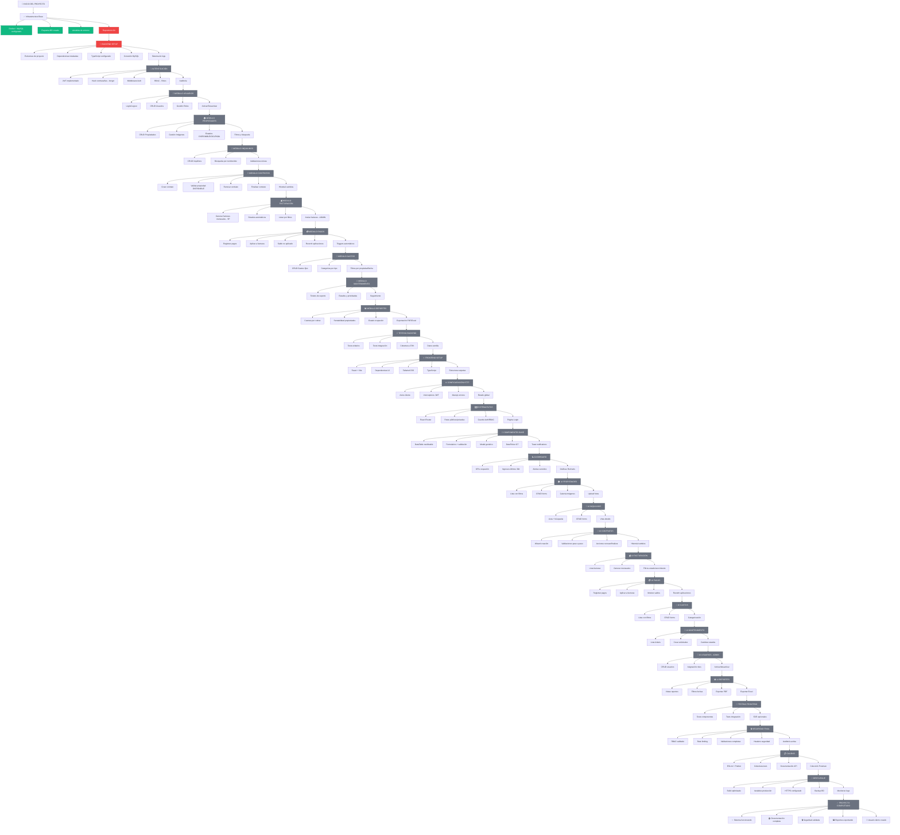
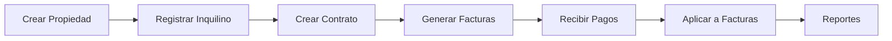
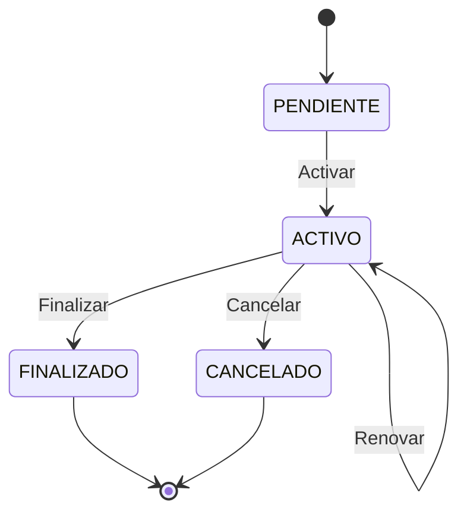
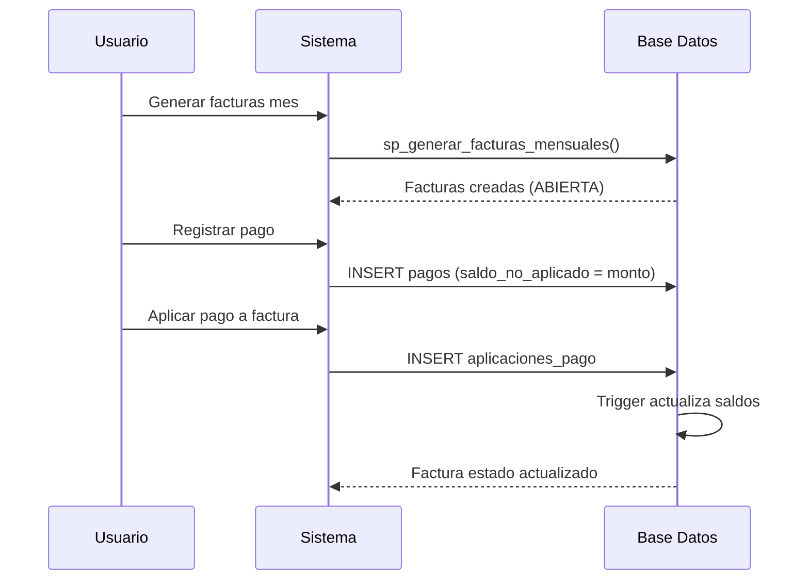

# 🌊 Diagrama de Flujo - Sistema de Alquiler

## 🎯 **Flujo de Desarrollo Recomendado**

### 📋 **Orden de Prioridades**:

1. **🔴 CRÍTICO** - Completar infraestructura base
2. **🟡 ALTA** - Backend core (auth, usuarios, propiedades, inquilinos)
3. **🟡 ALTA** - Frontend base (auth, componentes, propiedades)
4. **🟢 MEDIA** - Módulos de negocio (contratos, facturación, pagos)
5. **🟢 MEDIA** - Reportes y exportación
6. **🔵 BAJA** - Testing exhaustivo y optimizaciones

### 🚦 **Estados del Diagrama**:
- **🟢 Verde**: Completado
- **🟡 Amarillo**: En progreso
- **⚫ Gris**: Pendiente
- **🔴 Rojo**: Crítico/Bloqueante

### 📊 **Flujos de Datos Principales**:

### 🔄 **Flujo de Estados de Contrato**:

### 💰 **Flujo de Facturación y Pagos**:

